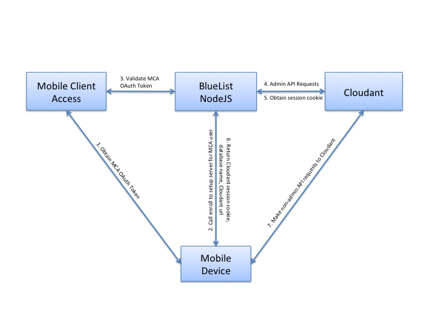

# IBM MobileFirst Platform for Android Bluelist Sample App
The sample uses the Cloudant NoSQL DB, Mobile Client Access, and IBM Push Notifications services.

### Downloading the samples
Clone the sample from Github with the following command:

    git clone https://github.com/ibm-bluemix-mobile-services/bms-samples-android-bluelist

### Configure the back end for your Bluelist application
Before you can run the Bluelist application, you must set up an app on Bluemix.  By setting up this app, service instances for the data, push, security, and monitoring functions of the app are configured.

1. Sign up for a [Bluemix](http://bluemix.net) Account.
2. Create a mobile app.  In the Boilerplates section Bluemix catalog, click **MobileFirst Services Starter**.  Choose a **Name** and click **Create**.
3. Select at least one Authentication method on Bluemix for your mobile App(Facebook, Google+, or Custom).
4. Optional: Configure Push:
	- If you don't have one already, create a GCM project in the [Google developer console](https://console.developers.google.com)
	- Navigate to **Credentials** underneath **APIs & Auth**
	- Select **Add credentials** --> **Api Key** --> **Server Key** --> **Create**
	- Copy the Server key you just created and the GCM Project number into the Push Notifications configuration dashboard

### Deploy the Bluelist NodeJS application to Bluemix 
You **must** use the Node.js runtime to host the Bluelist NodeJS application. Cloudant recommends operations that need 'admin' access to be performed in server side code.  A sample Node.js app for Bluelist is included in this repository.

Update the name, host and domain in the [NodeJS/manifest.yml](NodeJS/manifest.yml) file to match your Bluemix backend.

**Tip:** If your mobile app name on Bluemix has spaces, you must update the formatting of the app name and route in the `manifest.yml` file.
For example, if your app name on Bluemix is `myibmid Bluelist Sample`, make the following updates to the `manifest.yml` file:

`host: myibmid-bluelist-sample`
`name: "myibmid Bluelist Sample"`


[Download and install cf cli](http://docs.cloudfoundry.org/devguide/installcf/install-go-cli.html)

Deploy the Node.js app to Bluemix with the `cf` cli:    

- `cd NodeJS`
- `cf api https://api.ng.bluemix.net`
- `cf login`
- `cf apps`
- `cf push -f manifest.yml`


### Configure the front end in the Bluelist sample
1. Download and extract the most recent version of [Gradle](http://gradle.org/) onto your machine.
2. Open Android Studio and open the Android Bluelist Sample by selecting the build.gradle file.
   - **File** --> **Open** --> select `bms-samples-android-bluelist\bluelist`.
3. When prompted to use the default Gradle distribution, click **Cancel**, and enter the path to your local Gradle distribution that you downloaded in step 1.
4. Watch Gradle automatically pull in the required dependencies!

### Configure the back end in the Bluelist sample
- Update the file `bluelist.properties` file with your Backend Route and App UID.  These values can be found in Bluemix by selecting **Mobile Options** in your app overview(top right):

- applicationRoute: (for example `https://mymobilefirstapp.mybluemix.net`)
- applicationId:    (for example  `db33c037-cd0c-4985-affc-92b1cf8879b1`)

## Set up at least one authentication method

You can set up Facebook, Google, or custom authentication.
####Facebook authentication

A valid FacebookAppId needs to be configured in the MCA Dashboard.
From MCA Dashboard select Facebook and enter your FB appID.

In the Bluelist sample navigate to the strings.xml (`bms-samples-android-bluelist\bluelist\app\src\main\res\values\strings.xml`) and enter the same Facebook AppId to the ```facebook_app_id``` value.

[Learn more about using Facebook as an identity provider](https://www.bluemix.net/docs/services/mobileaccess/facebook-auth-android.html)    

For the Bluelist sample, you will need to make sure your Google Play package name in your Facebook app is `com.ibm.bluelist` and that your class name is `com.ibm.bluelist.SplashActivity`.

####Google authentication

A valid Android OAuth 2.0 Client ID needs to be configured in the MCA Dashboard.
From MCA Dashboard select Google and enter your Android Client ID.

[Learn more about using Google as an identity provider](https://www.bluemix.net/docs/services/mobileaccess/google-auth-android.html)

**Note:** If you switch from Facebbok auth to Google auth, make sure the ```facebook_app_id``` value is empty or else the wrong Response Listener will react.

####Custom authentication

 - Select Custom Auth from the MCA dashboard.
 - Enter `customAuthRealm_1` and your Bluemix App route respectively

The User `Yotem` with password `456` is hard coded into the sample and will authenticate automatically.

[Learn more about configuring a custom identity provider](https://www.bluemix.net/docs/services/mobileaccess/custom-auth.html)

### Enabling Encryption:

It is possible to encrypt the local data stores in order to secure data that is being stored on the device.

To enable encryption of local data you must complete the following:

Download the [SQLCipher](https://www.zetetic.net/sqlcipher/open-source/) for Android v3.2 or above `.jar` and `.so` binary files and include them in your application as described below:

Add the downloaded binaries to the appropriate folders within your app structure:
- Add the shared library files and `SQLCipher JAR` file to the `jniLibs` folder under your Android app directory.
- Add the required `ICU ZIP` file to your app `assets` folder.
- Add `sqlcipher.jar` as a file dependency. You can use the Dependencies tab under Open Module Settings, from the context menu of the Android Studio app folder. (This is done in the build.gradle file for you already)
- Uncomment the `keyProviderPw` in the `bluelist.properties` file.
- Uncomment lines 43 and 213 in `BlueListApplication.java`.
- Before creating the database for the first time, change the value to a new password.

To use `SQLCipher` commercially, you must obtain the necessary license.

*Warning*: Changing the password after creating the local database will generate an error because the existing database cannot be decrypted. You cannot change your password after the database has been encrypted. You must delete the database or reset the simulator to change passwords.

By default, encryption is not enabled until an `encryptionPassword` is provided in the `bluelist.propeties` file. After `encryptionPassword` is configured, the application uses this password to encrypt the local data store by using the above mechanisms. If `encryptionPassword` is left blank in the `bluelist.properties` file, encryption does not occur.

For more information on Encrypting Data please see the following doc:

[Encrypting data on a the device](https://www.bluemix.net/docs/services/data/index.html#t_data_encrypt)


### Run the Android App    


Now you can run your Android application in your mobile emulator or on your device.

Add items, change priorities, and replicate with the cloud by pulling down to refresh.

Notice that your data items have persisted. You now have data on the cloud!

##If you are Having trouble connecting

A simple Android sample is also available that checks your connection with the backend auth server. It can be found here:

- [android-helloWorld](https://github.com/ibm-bluemix-mobile-services/bms-samples-android-helloworld)

### Register Device for Push
Run the App on a real device or Simulator.
After App connects to Bluemix and the TODO items show up, tap the menu (top right).
Tap **Enable Push**, this will register the device with the Push service that you configured on Bluemix.

You can stop the application by closing the App or put on the background by pressing the home button.
When the App is not running or in the background, you will be able to see the push notification on the lock screen or from the iOS home screen, when you send the push notification.

### Test sending notifications from Bluemix
1. Log in to Bluemix.
2. From the DASHBOARD view, click your application.
3. Click the Push service icon.
4. Click the Notification tab.
5. Select all recipients
6. Compose a notification by filling in the Message text field with anything you want, and click NEXT.
7. Confirm message and Click SEND.
Watch as your mobile device receives a push notification!


### Test Interactive Push notifications
Compose a push notification and use the value `TODO_CATEGORY` for the push category.
When you receive the push message on the Android device you can swipe the message on the lock screen to the left, or pull down the push message from the Android home screen.


# Integrating Mobile Client Access with Cloudant Security
The IBM Mobile Client Access for Bluemix service gives your mobile application security. Cloudant has a separate security model.  The Cloudant and Mobile Client Access security models can be integrated using a small NodeJS application.  We demonstrate this integration in our [Bluelist Android Sample](https://github.com/ibm-bluemix-mobile-services/bms-samples-android-bluelist).  See the NodeJS folder for the application.

## BlueList NodeJS Sample
To understand the BlueList NodeJS sample that is included with BlueList, it is important to understand both [Cloudant Security](https://cloudant.com/for-developers/faq/auth/) and [Mobile Client Access](https://www.bluemix.net/docs/services/mobileaccess/index.html). Once you have this foundation, the BlueList NodeJS sample is simple to understand.

The BlueList NodeJS sample has two primary functions:
	1. Exchange MCA OAuth tokens for Cloudant session cookies
	2. Perform BlueList's require `admin` requests to Cloudant

Using this pattern, a compromised mobile device has restricted access to Cloudant.

The sample demonstrates how to perform API requests that require `admin` access on the server where it is secure.  While it is possible to place your admin credentials on the mobile device, it is a better practice to restrict access from mobile devices.

The BlueList sample integrates Mobile Client Access security with Cloudant security.  The NodeJS sample maps a Mobile Client Access identity to a Cloudant identity.  The mobile device receives a Cloudant session cookie to perform non-admin API requests. The sample uses the Couch Security model.

### enroll REST Endpoint
The following diagram illustrates the integration performed by the BlueList NodeJS sample `/enroll` endpoint.


1. Mobile device obtains the MCA OAuth token from the MCA service.
2. Mobile device calls `/enroll` endpoint on the BlueList NodeJS.
3. BlueList NodeJS Sample validates the MCA OAuth token with the Mobile Client Access Service.
4. If valid, performs `admin` API requests to cloudant.  The sample checks for an existing Cloudant user in the `_users` database.
- If existing user, lookup Cloudant admin credentials in the `_users` database.
- If new user, use the Cloudant admin credentials, create a new Cloudant user and store in the `_users` database.
- Generate a unique database name for the user and create a remote database on Cloudant with that name.
- Give the Cloudant user permissions to read/write the newly created database.
- Create the required indexes for the BlueList application.
5. Request a new Cloudant session cookie.
6. BlueList NodeJS sample returns Cloudant session cookie, remote database name, and Cloudant URL to the mobile device.
7. Mobile device makes requests directly to Cloudant until the session cookie expiries.

### sessioncookie REST Endpoint
In the case of an expired session cookie, the mobile device can exchange a valid MCA OAuth token for a Cloudant session cookie using the `/sessioncookie` endpoint.

### License
This package contains sample code provided in source code form. The samples are licensed under the under the Apache License, Version 2.0 (the "License"). You may obtain a copy of the License at http://www.apache.org/licenses/LICENSE-2.0 and may also view the license in the license.txt file within this package. Also see the notices.txt file within this package for additional notices.
